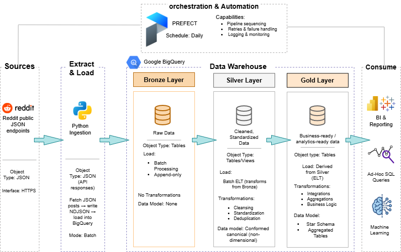

# Reddit Topic Warehouse
## Overview

Reddit generates millions of posts daily. This project builds a production-style ELT pipeline that captures, transforms, and models that data into analytics-ready tables, tracking subreddit activity trends over time. This project implements an automated data pipeline that ingests Reddit posts into BigQuery, transforms them using dbt, and orchestrates execution with Prefect and GitHub Actions.

The pipeline supports:

- Automated ingestion

- Layered transformations (bronze → silver → gold)

- Data validation

- Scheduling and monitoring

- End-to-end failure propagation across systems

It is designed as a production-style ELT pipeline with clear separation of concerns between ingestion, transformation, and orchestration.

## Architecture




**Bronze Layer**

- Raw, append-only ingestion of Reddit post data

- Stored in BigQuery

- No transformations applied

- Preserves original structure and values

**Silver Layer**

- Cleaned and standardized dataset

- JSON fields parsed into structured columns

- Type normalization and filtering applied

- Represents conformed, non-dimensional data

**Gold Layer**

- Analytics-ready dimensional and fact tables

- Aggregated metrics and business logic applied

- Star-schema style design
## Tech Stack
| Component       | Tool                   |
|-----------------|------------------------|
| Ingestion       | Python                 |
| Data Warehouse  | Google BigQuery        |
| Transformation  | dbt                    |
| Orchestration   | Prefect                |
| CI / Execution  | GitHub Actions         |
| Scheduling      | Windows Task Scheduler |
| Source          | Reddit JSON endpoints  |

## Data Model
**Silver Layer**

- reddit_posts_clean
  - Cleaned and structured Reddit post data

**Gold Layer**

- dim_subreddit

- dim_date

- fct_subreddit_daily_activity

**Metrics**

- Daily post counts per subreddit

- Aggregated activity by date

- Time-based analytics (daily granularity)

# Pipeline Logic
**Local Machine (Prefect)**

- Fetch Reddit posts from selected subreddits

- Load raw data into BigQuery bronze layer

- Validate bronze freshness (last 26 hours)

- Trigger GitHub Actions workflow

- Wait for GitHub workflow to finish

- Fail the pipeline if downstream jobs fail

**GitHub Actions**

1. Run dbt models:

    - staging

    - silver

    - gold

2. Run dbt tests

3. Upload dbt artifacts

## Automation

The pipeline runs daily using a hybrid scheduling approach:

- Windows Task Scheduler
  - Triggers the local Prefect flow for ingestion and validation

- GitHub Actions (scheduled + triggered)
  - Executes dbt transformations in a cloud runner

This setup reflects real-world constraints where data access is local but transformations run in cloud infrastructure.

## Data Quality

Implemented checks include:

- Bronze freshness validation (last 26 hours)

- dbt tests:

   - not_null

   - unique

   - relationship tests

- End-to-end failure propagation across Prefect and GitHub Actions

Failures at any stage stop downstream execution.

## Why This Project Matters

This project demonstrates:

- Hybrid orchestration (local + cloud)

- Modern ELT warehouse design

- Handling real-world API constraints

- Data validation strategies

- Production-style pipeline control and monitoring

## Future Improvements

- Replace local ingestion with containerized runner

- Add historical backfill support

- Add partitioned bronze tables

- Implement incremental dbt models

## Repository Structure

```text
├── dbt/
│   └── models/
│       └── reddit_topic_warehouse/
├── src/
│   └── ingest/
├── orchestration/
│   └── prefect_flow.py
├── docs/
│   └── architecture/
├── .github/
│   └── workflows/
└── README.md


